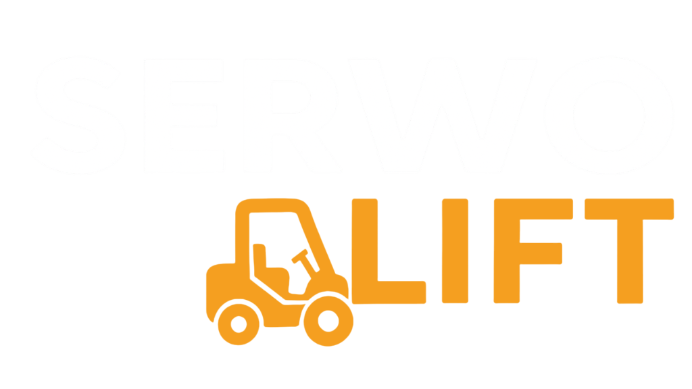

# Serwo - One-Page website for a company providing maintenance services for material handling equipment

<div align="center">
  
</div>

## Table of Contents
- 🚀 [Project Overview](#project-overview)
- ✨ [Features](#features)
- 💻 [Technologies](#technologies)
- 📋 [Requirements](#requirements)
- 🛠️ [Setup Instructions](#setup-instructions)
- 📸 [Screenshots](#screenshots)

## Project Overview
Serwo is a website presenting the range of possible repairs provided by a company servicing material handling equipment.
> [!NOTE]  
> Website is only available in Polish language version!

## Features

- 🔄 Rotating carousel of brands serviced by the company
- 🧭 Mobile app-style menu for easy navigation 
- 💬 Contact form for quick communication with Serwolift specialists
- 📱 Full responsiveness

## Technologies

**Frontend**
- Next.js
- React
- Tailwind CSS
- Framer Motion
- Lucide
- EmailJS

## Requirements
Software versions used for development:
- Next.js 15.2.4
- React 19.1.0
> [!WARNING]  
> Compatibility with earlier versions has not been tested.

## Setup Instructions
To run a project locally, you must have Node.js and npm installed. 
> [!IMPORTANT]  
> *Download guide: [Installing Node.js and npm](https://docs.npmjs.com/downloading-and-installing-node-js-and-npm)*

You must also have the MongoDB Compass app downloaded or the MongoDB Atlas service configured.

1. Download and extract the Serwo folder.
2. Navigate to the `Serwo` folder in your terminal.
3. Install dependencies and launch the app:
```
$ npm install
$ npm run dev
```
4. Access the application at [http://localhost:3000](http://localhost:3000).

## Screenshots


### Mobile Device
 
 
